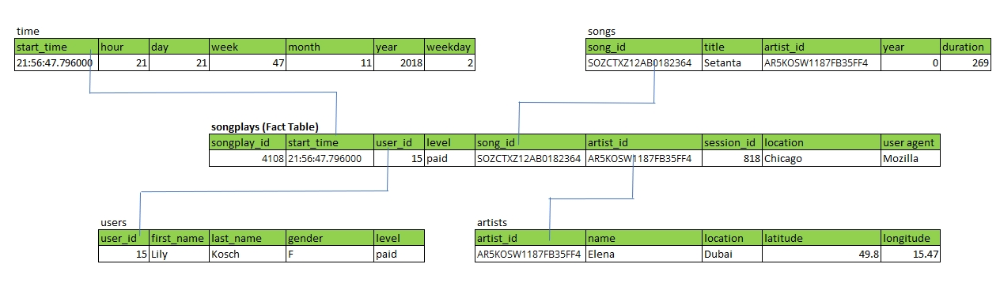
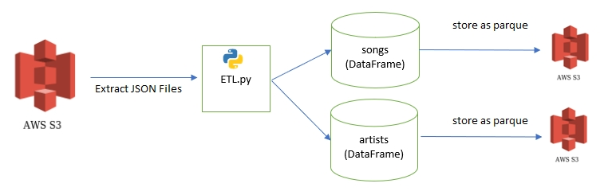
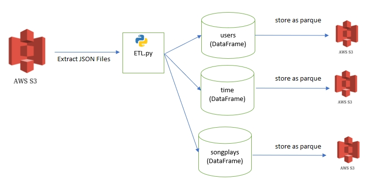

# Project: Data Lake

## Introduction

A music streaming startup, Sparkify, has grown their user base and song database even more and want to move their data warehouse to a data lake. Their data resides in S3, in a directory of JSON logs on user activity on the app, as well as a directory with JSON metadata on the songs in their app.

They'd like a data engineer to create ETL pipeline that extracts their data from S3, process them using Spark, and loads the data back into S3 as a set of dimensional tables. This will allow their analytic team to continue finding insights in what songs their users are listening to.

## Project Description

In this project, I'll apply what I've learned on Spark and data lakes to build an ETL pipeline for a data lake hosted on S3. To complete the project, I will need to load data from S3, process the data into analytic tables using Spark, and load them back into S3. I'll deploy this Spark process on a cluster using AWS.

## Repository

In addition to the data files, the project workspace include five files:
1. `etl.py` reads data from S3, process that data using Spark, and writes them back to S3
2. `dl.cfg` contains my AWS credentials
3. `README.md` provides discussion on my process and decisions

## Database Schema Design

## ETL Pipeline

Song dataset will be processed by python program `etl.py` and data will be stored in S3 (parque format)

Log dataset will be processed by python program `etl.py` and data will be stored in S3 (parque format)

## How to Run

Open the terminal then run below statement to run ETL pipeline process
`python etl.py`

